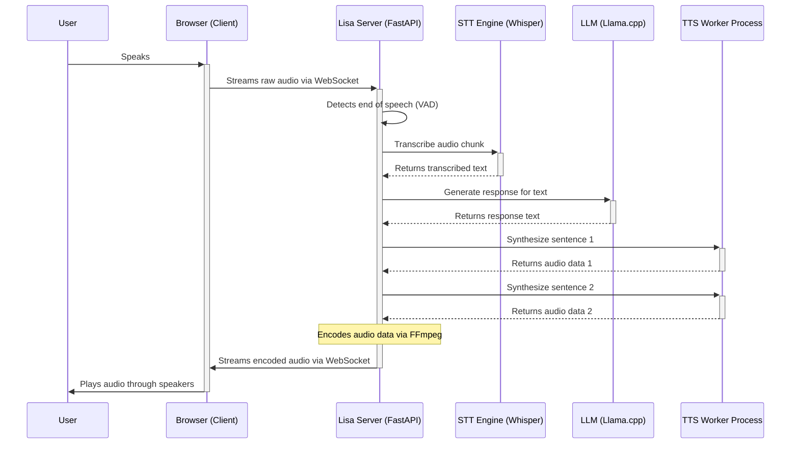

# Architecture Diagrams - Lisa AI Voice Assistant

This document contains diagrams that visualize the current and future architecture of the Lisa application within a broader AI ecosystem.

## Current Architecture (Lisa as a Voice I/O Service)

In this refined architecture, Lisa's primary role is to act as a dedicated Voice Input/Output (I/O) Service. It handles the real-time, two-way voice interaction, including Speech-to-Text (STT) and Text-to-Speech (TTS). Lisa now communicates with a central Orchestration Service (Mickey) for intelligent responses.

```mermaid
graph TD
    subgraph Client (User Device)
        A[Microphone Input] --> B(Audio Processing);
        B -- "Raw Audio Chunks (WebSocket)" --> C[Lisa AI Voice I/O Service];
        C -- "Streamable WebM/Opus Packets (WebSocket)" --> D[Audio Output];
    end

    subgraph Lisa AI Voice I/O Service (main.py)
        C --> E[FastAPI Server (WebSocket)];
        E --> F[STT Engine (Faster Whisper)];
        F -- "Transcribed Text" --> G[Mickey Orchestration Service];
        G -- "Text for TTS" --> E;

        subgraph Dedicated API Endpoints (for Orchestrator/Other Services)
            I[POST /stt (Audio In)] --> F;
            E --> J[POST /tts (Text Out)];
        end
    end

    subgraph External Services
        G[Mickey Orchestration Service]
    end
```

**Components:**

*   **Client (User Device):** The user's interface for voice interaction, handling microphone input and audio playback.
*   **Lisa AI Voice I/O Service:**
    *   **FastAPI Server (WebSocket):** Manages real-time audio and text streaming with the client.
    *   **STT Engine (Faster Whisper):** Transcribes incoming audio into text.
    *   **Mickey Orchestration Service:** Lisa sends transcribed text to Mickey and receives text for TTS from Mickey.
    *   **TTS Engine:** Converts text responses into natural-sounding speech.
    *   **Dedicated API Endpoints:** Exposes STT and TTS functionalities as separate REST endpoints for consumption by an Orchestration Service or other applications.

## Future Architecture (with Central Orchestration)

This diagram illustrates the long-term vision for Lisa within a modular, scalable AI ecosystem, where a central Orchestration Service coordinates interactions between various specialized AI modules.

```mermaid
graph TD
    subgraph User Interaction Layer
        A[User Device] --> B(Mickey Orchestration Service);
    end

    subgraph Core AI Services
        B -- "Audio Input" --> C[Lisa AI (STT/TTS Service)];
        B -- "Text/Context" --> D[Riley AI (Intelligence/Memory Service)];
        B -- "Text/Context" --> E[Other AI Modules (e.g., Knowledge Base, Persona)];
        C -- "Transcribed Text" --> B;
        D -- "Intelligent Response" --> B;
        E -- "Processed Data" --> B;
        B -- "Text for TTS" --> C;
        C -- "Audio Output" --> B;
    end

    subgraph Data & Management
        D --> F[Memory Databases];
        B --> G[API Gateway/Load Balancer];
        G --> B;
    end
```

**Key Principles of Future Architecture:**

*   **Central Orchestration:** A dedicated service manages the flow of information between the user and various AI modules, coordinating complex conversational turns.
*   **Modular Services:** Each core AI function (Voice I/O, Intelligence/Memory, etc.) is a distinct, independently deployable service.
*   **Scalability:** Services can be scaled horizontally based on demand.
*   **Flexibility:** New AI modules can be easily integrated into the orchestration layer.
*   **Independent Access:** Individual services (like Lisa's STT/TTS or Riley's memory) can be called directly by other applications if needed.

## Roadmap to a Reusable Agent

This section outlines the high-level steps to evolve the Lisa application into a robust, reusable, and scalable AI voice agent within a modular ecosystem.

### Step 1: Prove the Core Functionality (Achieved & Refined)

The immediate goal of getting the core application working has been achieved and significantly refined. The system now features a robust, real-time, two-way voice pipeline with a declarative resource management system for its multi-engine TTS backend. This ensures stability and optimal performance by dynamically allocating resources based on both the selected engine's profile and live system stats. The application is also containerized via Docker Compose.

### Step 2: Refactor Lisa as a Dedicated Voice I/O Service

*   **Expose Dedicated API Endpoints:** Implement clear REST API endpoints within Lisa for its STT and TTS functionalities, allowing external services to consume them.
*   **Internal LLM Management:** Refine how Lisa's internal LLM is used, especially when an Orchestration Service or Riley is providing the primary intelligence.
*   **Robust Error Handling:** Implement comprehensive error handling for all voice I/O processes.

### Step 3: Introduce the Orchestration Service

*   **Design Orchestrator Logic:** Define how the Orchestration Service will route requests, manage conversational state, and coordinate calls to Lisa, Riley, and other modules.
*   **Implement Core Routing:** Develop the initial logic for directing user input to the appropriate AI service.
*   **Integrate with Lisa's New APIs:** Ensure the Orchestration Service can seamlessly call Lisa's dedicated STT and TTS endpoints.

### Step 4: Integrate Riley AI (Intelligence & Memory Service)

*   **Develop Riley's Core:** Build Riley as a separate service with its own API, focusing on NLU, memory management, and intelligent response generation.
*   **Integrate with Orchestrator:** Enable the Orchestration Service to call Riley's APIs for intelligence and memory processing.

### Step 5: Deploy and Scale

With the modular services defined, focus on deployment and scalability:

*   **Containerization:** Lisa is already containerized and deployed via Docker Compose. Focus shifts to packaging Riley and Orchestrator into their own Docker containers.
*   **Deployment Strategy:** Define how these containers will be deployed (e.g., Kubernetes, Docker Compose).
*   **Horizontal Scaling:** Implement strategies for running multiple instances of each service behind load balancers.
*   **Asynchronous Communication:** Explore message queues for inter-service communication to improve reliability and performance.

## End-to-End Workflow

This diagram illustrates the step-by-step sequence of events for a typical user interaction, from speaking to hearing a response.

